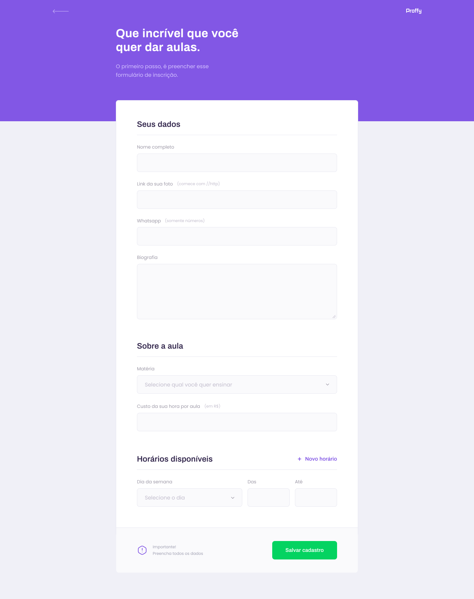

  

# 📋 Índice

### [Sobre o Projeto](#-sobre-o-projeto)

- [Tecnologias utilizadas](#-tecnologias-utilizadas)
- [Design](#-design)
- [Executar esse projeto no seu computador](#Executar-esse-projeto-no-seu-computador)

# 💡 Sobre o Projeto

Criação do Proffy, uma plataforma para conexão professores e alunos.

## 💻 Tecnologias utilizadas

O projeto foi desenvolvido utilizando as seguintes tecnologias:

- ReactJS
- React Native
- TypeScript
- HTML5 e CSS3
- NodeJS

## 🌌 Design

Design feito por [Tiago Luchtenberg](https://www.instagram.com/tiagoluchtenberg/)

### Desktop

|  |  |
| ------------------------------------------------ | ----------------------------------------------- |

### Mobile

|  |  |
| --------------------------------------------------- | ------------------------------------------------ |

# Executar esse projeto no seu computador

- Clonar Repositório: `git clone https://github.com/Pedrusco/Proffy.git`

Antes de executar, primeiro é preciso instalar as dependências:

- Abra o seu terminal e vá até pasta destino onde você clonou este repósitorio e acesse o diretório `server` e depois execute `npm install` ou `yarn install` **(Isso dependerá do gerenciador de pacotes instalado no seu computador)**

- Faça o mesmo procedimento do item anterior só que no diretório `web`

Ir para a pasta 'web' para rodar o front-ent e ir para pasta 'server' para rodar o back-end (você irá rodar tanto o front-end e back-end em paralelo):

- Rodar Aplicação: `npm start` ou `yarn install` **(Isso dependerá do gerenciador de pacotes instalado no seu computador)**

## 📜 Licença

Todos os arquivos incluídos aqui, incluindo este _ README _, estão sob [Licença MIT](./LICENSE).
Criado por [Pedro Fernandes](https://github.com/Pedrusco)
